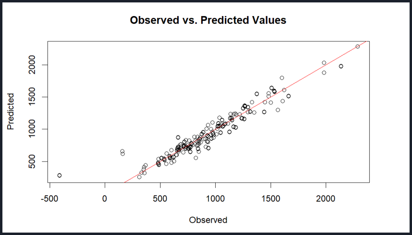
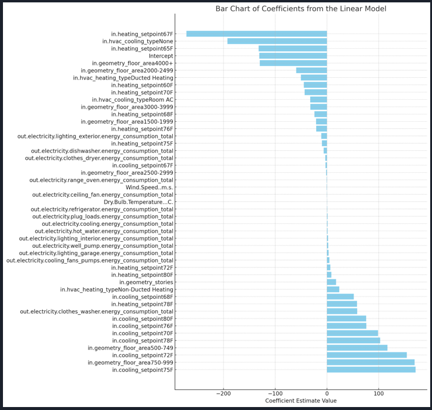

<h1>Project Description</h1> 

This project focused on designing a scalable information system for National Booksellers Inc., a company that purchases books and CDs from vendors and distributes them to retailers. The goal was to replace an outdated system by developing a more efficient, user-friendly solution capable of supporting increased demand and improving overall operations. 

I worked through the full systems analysis lifecycle, beginning with defining project scope and separating functional requirements (order processing, inventory management, returns) from non-functional requirements (performance, security, and scalability across locations). I then developed Data Flow Diagrams (DFDs) to map system processes and Entity-Relationship Diagrams (ERDs) to define the underlying data structure and relationships between customers, products, and vendors. 

In addition to system modeling, I contributed to designing user interfaces for both customers and managers, including order entry forms, inventory dashboards, and reporting tools. This ensured that technical system requirements were translated into practical, user-centered features that support day-to-day business operations. 

Overall, this project demonstrates my ability to design end-to-end information systems, translate business requirements into technical models, and create structured, scalable solutions for real-world organizational challenges. 

<h2>Key Results</h2>
- Designed a scalable system architecture to replace an inefficient legacy system  
- Created clear data and process models to improve system understanding and communication  
- Developed user-focused interface designs to support operational workflows  

<h2>Tools Used:</h2> 
<b>Techniques:</b> Systems Analysis, Requirements Gathering, Process Modeling  
<b>Modeling Tools:</b> Data Flow Diagrams (DFDs), Entity-Relationship Diagrams (ERDs)  
<b>Concepts:</b> Functional vs Non-Functional Requirements, System Design, Data Modeling  
<b>Applications:</b> Draw.io, PowerPoint, Canva 

<h2>Key Visualisations:</h2>
sdfs  
  

sdfs  
