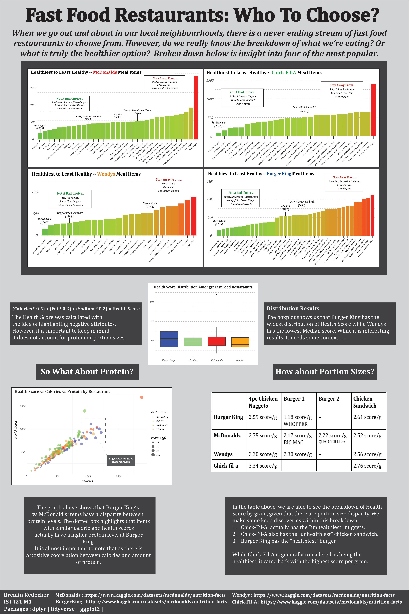
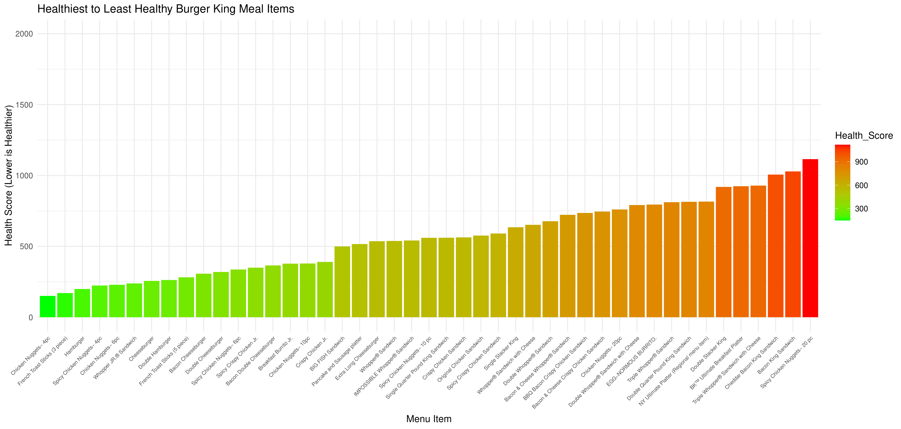
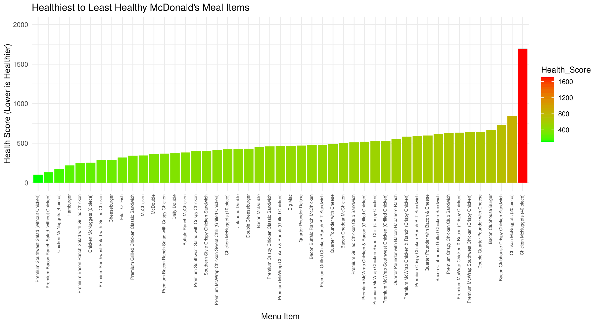
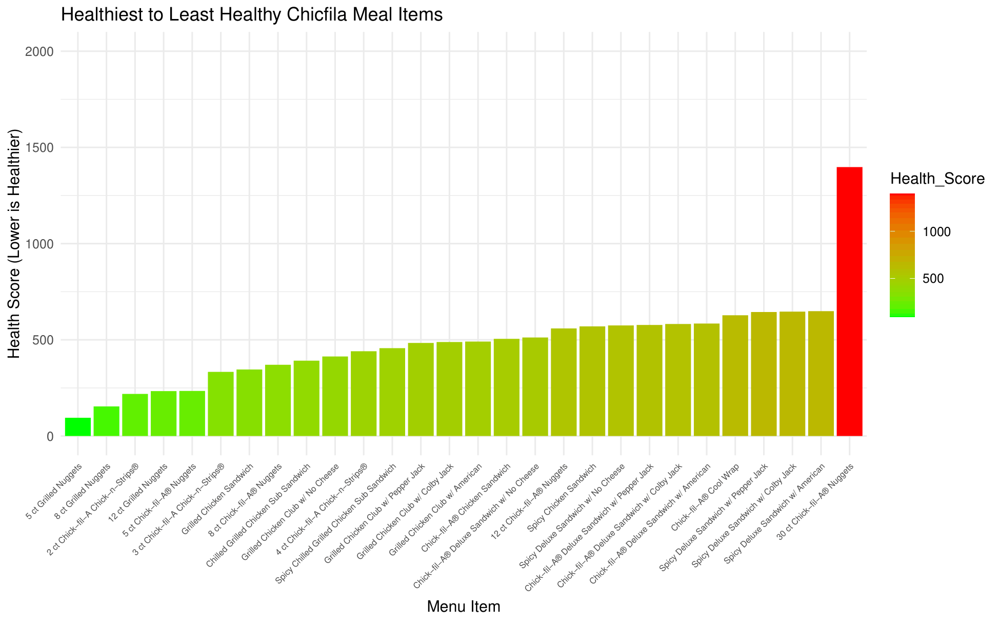
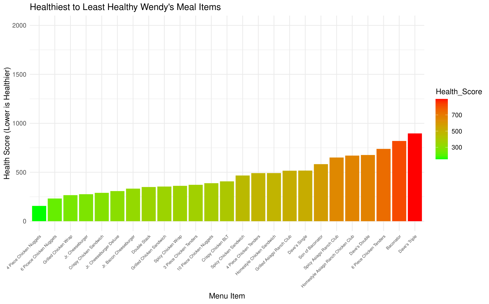
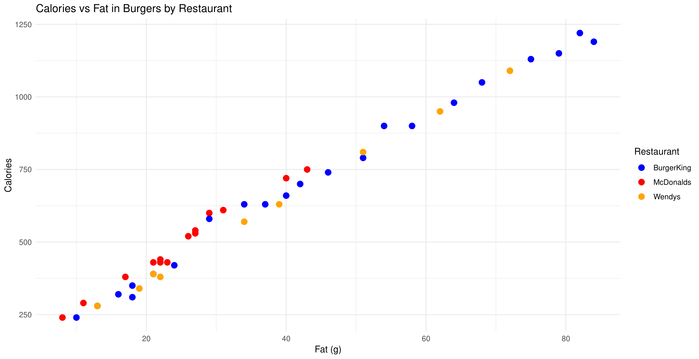
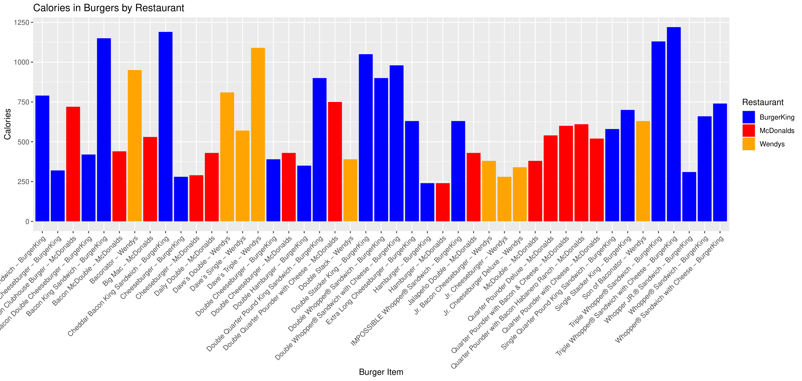

<h1>Project Description</h1> 

This project explores the question: which fast food restaurant is actually the healthiest? I collected nutritional data from four major chains—McDonald’s, Burger King, Chick-fil-A, and Wendy’s—and cleaned, standardized, and merged the datasets into a single structured dataset for analysis.  

To enable meaningful comparisons, I developed a custom “health score” that weighted calories, fat, and sodium to quantify the overall nutritional value of each menu item. This allowed me to rank items within each restaurant and directly compare menus across brands using a consistent metric.  

Using data visualization, I analyzed patterns in health scores, relationships between calories and fat, and differences across food categories such as burgers and chicken. The results challenged common assumptions—restaurants often perceived as “healthier” did not consistently outperform others when evaluated quantitatively, and factors like portion size and protein content added important context.  

Overall, this project demonstrates my ability to build and clean multi-source datasets, engineer meaningful metrics, and communicate data-driven insights through effective visual storytelling. 

<h2>Key Results</h2>
- Developed a custom scoring system to standardize health comparisons across restaurants  
- Found that “healthier” brand perception did not consistently align with nutritional data  
- Identified strong relationships between calories, fat, and portion size across menu items  
- Brand perception of “healthiness” does not consistently match actual nutritional value across menu items  

<h2>Tools Used:</h2> 
<b>Languages:</b> RStudio  
<b>Libraries:</b> dplyr, ggplot2  
<b>Techniques:</b> Data Cleaning, Data Merging, Feature Engineering, Exploratory Data Analysis (EDA), Data Visualization  
<b>Data:</b> Multi-source nutritional datasets from major fast food chains (McDonalds, Wendys, Burger King, Chic-Fil-A)  
<b>Sources:</b> Kaggle  

<h2>Key Visualisations:</h2>
Final Poster  
  

Burger King Health Index  
  

McDonalds Health Index  
  

Chic-Fil-A Health Index  
  

Wendys Health Index  
  

Burger Scatterplot  
  

Burger Barchart  
  
