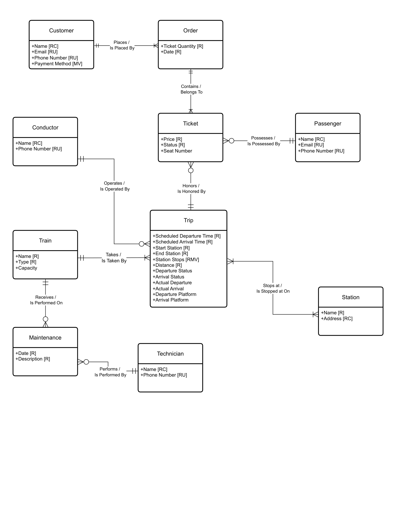
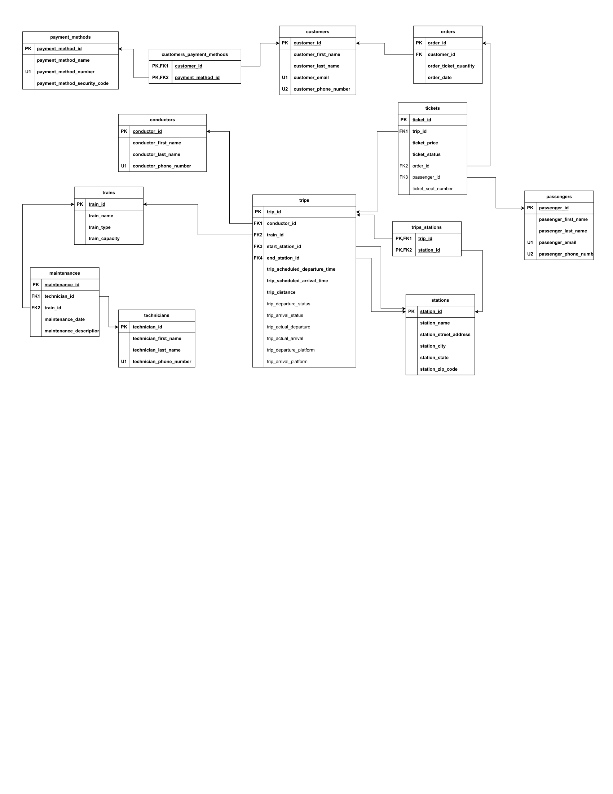

<h1>Project Description</h1> 
This project focused on designing and building a Passenger Train Management System using a relational database approach. The goal was to address real-world challenges in train operations, including inefficient ticket booking, lack of transparency around delays, and limited coordination between passengers, operators, and maintenance teams. 

I developed the system’s data architecture by identifying key data requirements and creating a conceptual model that defined core entities such as passengers, trips, trains, tickets, and stations, along with their relationships. This was followed by building a logical data model and a fully normalized schema to reduce redundancy and ensure data consistency across the system. 

Beyond database design, I implemented core functionality using SQL, including stored procedures, functions, and triggers. These supported complex workflows such as secure ticket purchasing, schedule validation, and automated enforcement of business rules (e.g., preventing bookings for past trips or canceling tickets for canceled routes). Transactions were used to ensure data integrity through ACID principles, resulting in a reliable and robust system. 

Overall, this project demonstrates my ability to design and implement end-to-end database systems, combining data modeling, normalization, and advanced SQL techniques to solve complex, real-world operational challenges. 

<h2>Key Results</h2>
- Designed a fully normalized relational database to support complex train operations  
- Automated critical workflows using SQL procedures, triggers, and functions  
- Ensured data integrity and reliability through transaction management and ACID principles  

<h2>Tools Used:</h2> 
<b>Languages:</b> SQL  
<b>Technologies:</b> Relational Database Design, Stored Procedures, Triggers, Functions  
<b>Concepts:</b> Normalization, ER Modeling, ACID Transactions, Data Integrity  
<b>Tools:</b> Docker Desktop, Visual Studio Code, Excel, PowerPoint 

<h2>Key Visualisations:</h2>
Conceptual Model  
  

Logical Model  
  