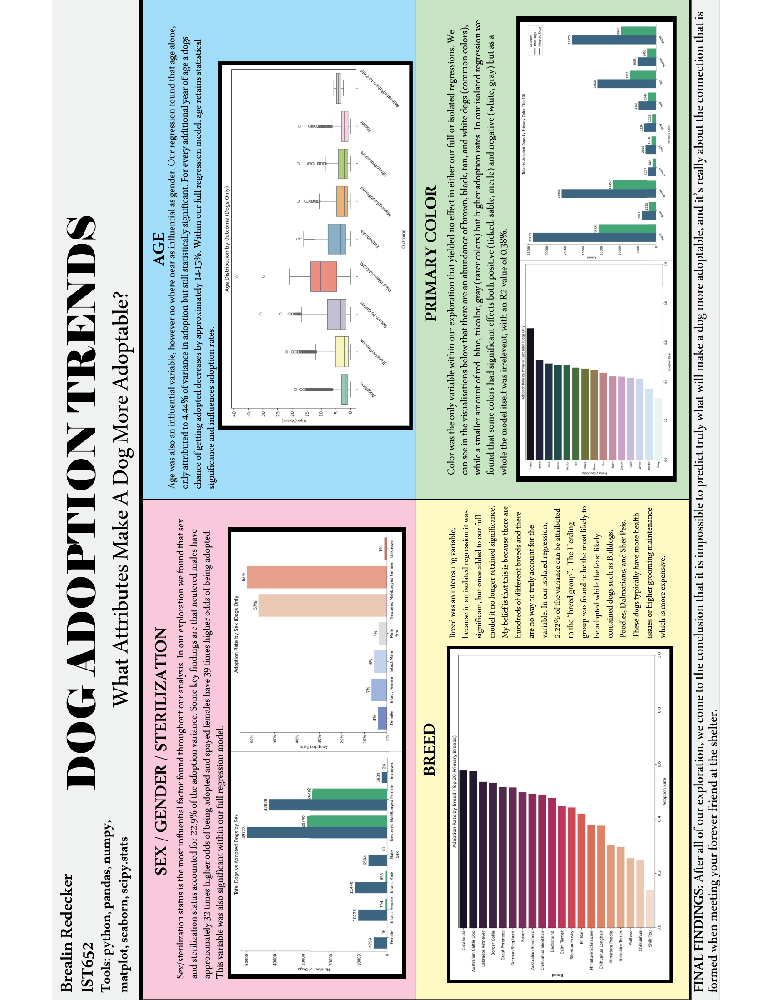
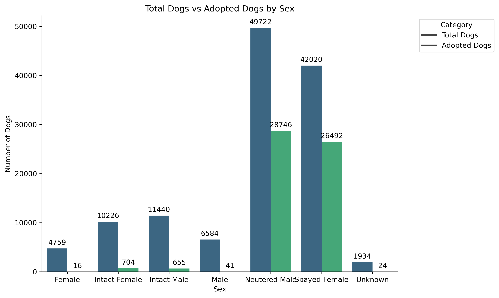
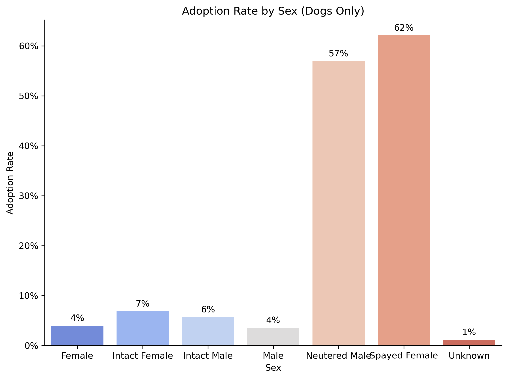
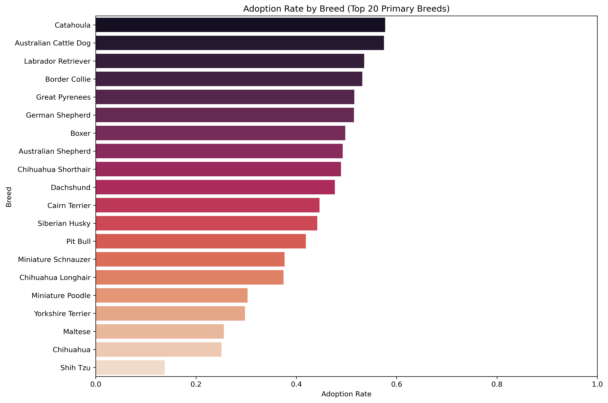
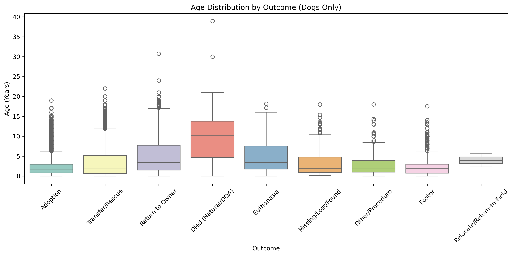
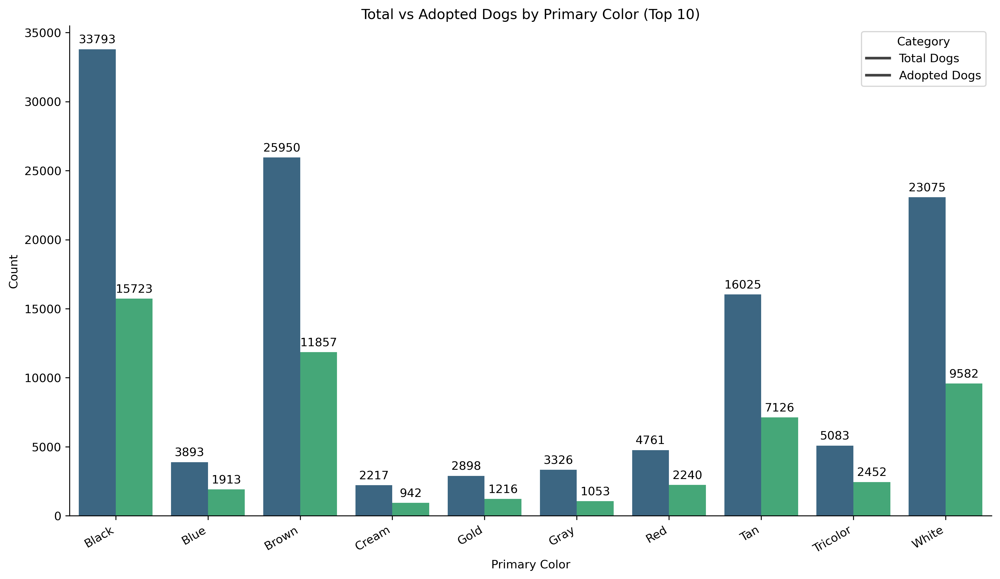
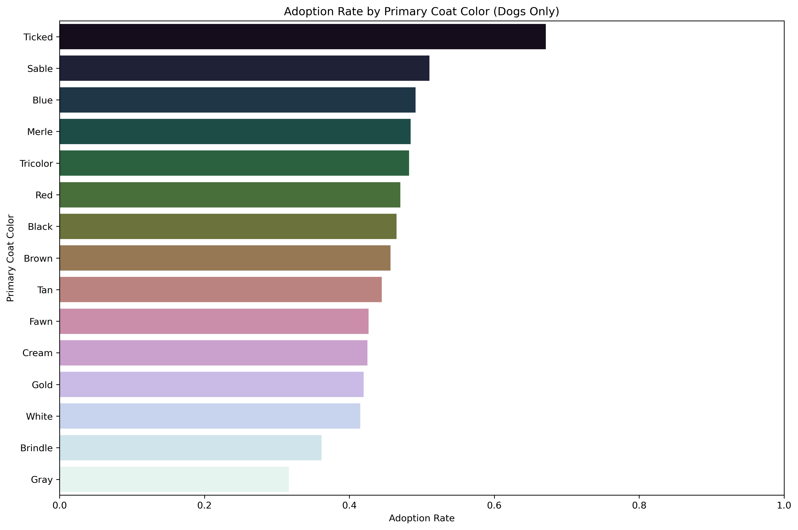

<h1>Project Description</h1> 

This project focused on analyzing animal shelter data from three major U.S. cities—Austin, Long Beach, and San Jose—to better understand the factors influencing dog adoption outcomes. The dataset contained over 350,000 records across multiple years, requiring extensive data cleaning, standardization, and transformation before analysis. 

A key component of the project involved merging datasets with inconsistent structures and standardizing variables such as breed, color, outcome type, and sex. I engineered new features, including age and age group, and created cleaned categorical variables to improve data quality and consistency. This process highlighted real-world data challenges such as missing values, inconsistent labeling, and variations in data collection across sources. 

Using statistical analysis and regression modeling, I evaluated which variables had the strongest impact on adoption outcomes. The results showed that sex and sterilization status were the most influential predictors, while age had a negative relationship with adoption likelihood. Other variables, such as color and breed, showed weaker or inconsistent effects across models. 

To communicate findings, I developed visualizations including distribution plots, boxplots, and cross-shelter comparisons. These revealed key trends, such as higher adoption rates for younger animals and spayed/neutered dogs. Overall, the project demonstrates the complexity of predicting adoption outcomes and the importance of combining data cleaning, modeling, and visualization to uncover meaningful insights. 

Overall, this project highlights my ability to work with large, messy datasets, perform end-to-end data analysis, apply statistical modeling, and communicate insights through clear visual storytelling.  

<h2>Key Results</h2>
- Processed and standardized 350k+ records across multiple cities and datasets  
- Identified sterilization status and sex as the strongest predictors of adoption outcomes  
- Found that younger animals have significantly higher adoption rates  
- Demonstrated that breed and color have limited and inconsistent predictive power  

<h2>Tools Used:</h2> 
<b>Languages:</b> Python  
<b>Libraries:</b> pandas, NumPy, matplotlib, seaborn  
<b>Techniques:</b> Data Cleaning, Data Merging, Feature Engineering, Regression Modeling, Exploratory Data Analysis (EDA)  
<b>Tools:</b> Jupyter Notebook, Canva  

<h2>Key Visualisations:</h2>
Final Poster  
  

Adoption Counts by Sex  
  

Adoption Rate by Sex  
  

Adoption Rate By Breed (Top 20)  
  

Boxplot of Ages  
  

Adoption Counts by Color  
  

Adoption Rate by Color  
  