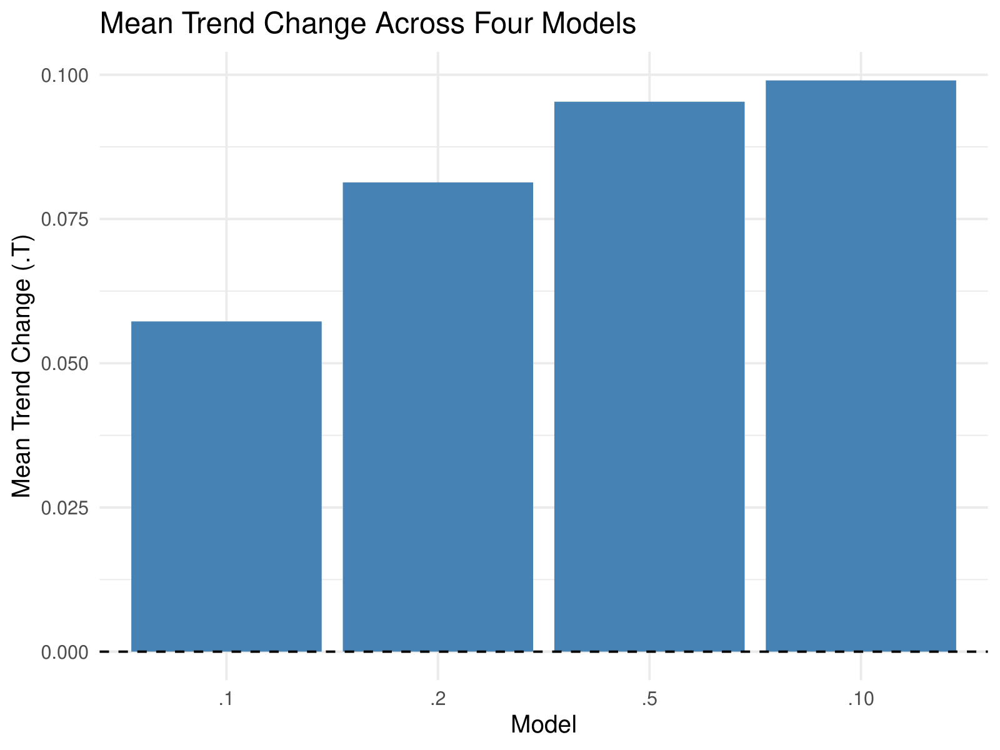
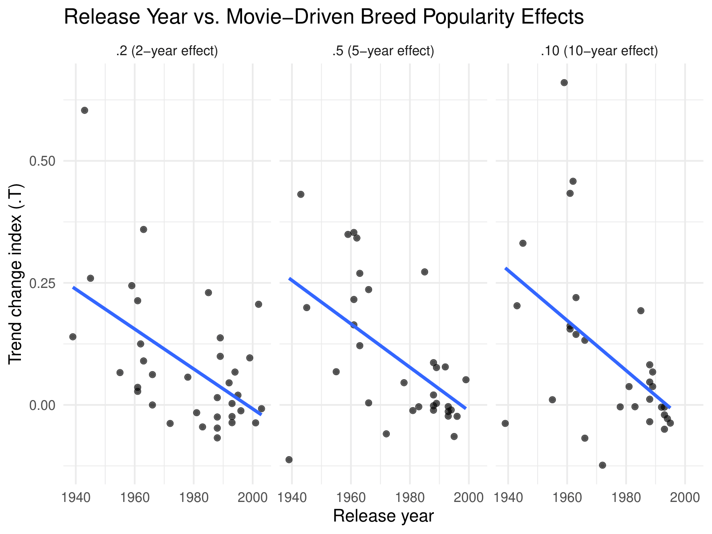
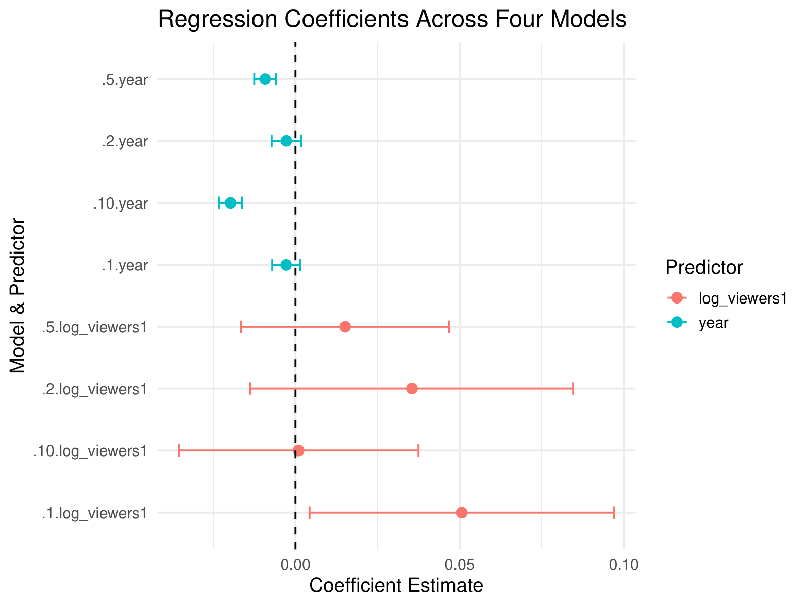
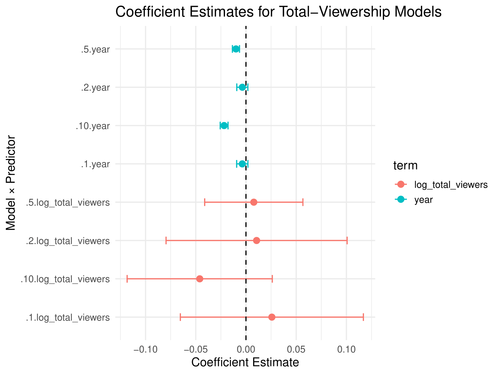
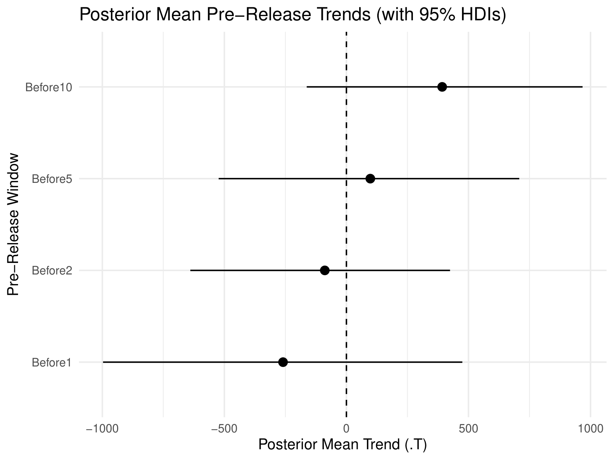
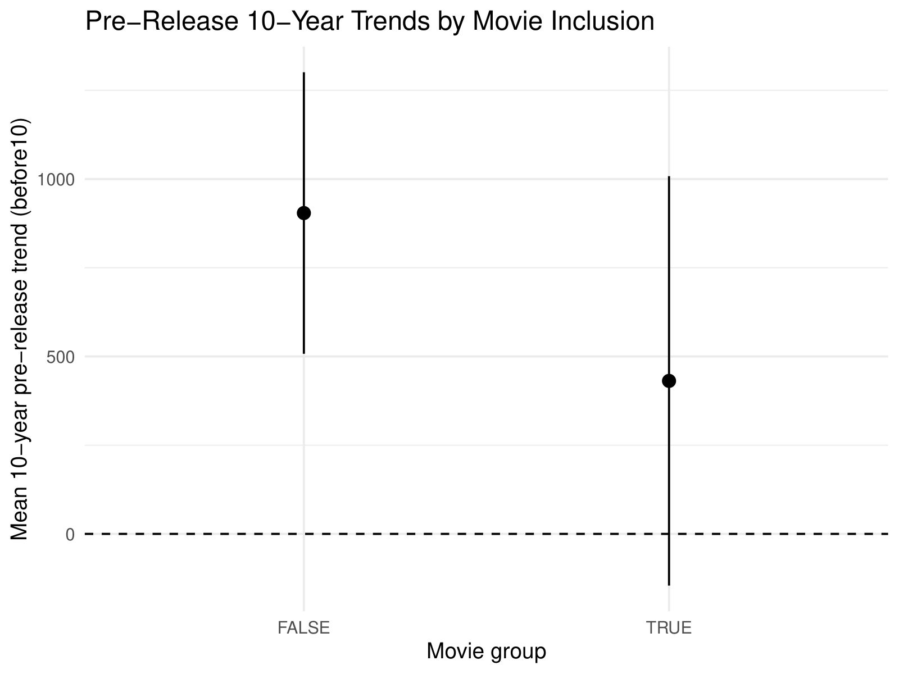

<h1>Project Description</h1>
<h3><a href="https://journals.plos.org/plosone/article?id=10.1371%2Fjournal.pone.0106565&utm_source=chatgpt.com">Initial Case Study</a></h3>

This project involved replicating and extending the academic study “Dog Movie Stars and Dog Breed Popularity” to analyze how media influences real-world consumer behavior. Using datasets from the American Kennel Club and curated movie data, I investigated whether films featuring specific dog breeds lead to measurable increases in breed popularity over time. 

I structured the analysis by recreating key components of the original study, including trend-change metrics across multiple time horizons (1, 2, 5, and 10 years). To strengthen the analysis, I applied both frequentist and Bayesian methods, including one-sample t-tests, correlation analysis, linear regression models, and non-parametric tests. This dual-method approach allowed for validation of results and comparison of statistical interpretations across methodologies. 

The results showed that movies have a statistically significant impact on dog breed popularity, with effects lasting up to a decade after release. However, the influence of movies has declined over time, with older films demonstrating stronger long-term effects than more recent releases. Additionally, there was little evidence that breeds were already trending upward prior to being featured, supporting a causal relationship between media exposure and increased popularity. 

Overall, this project demonstrates my ability to replicate academic research, apply advanced statistical techniques, and evaluate causation versus correlation in complex, real-world datasets. 

<h2>Key Results</h2>
- Found statistically significant increases in breed popularity following movie releases  
- Identified long-term effects lasting up to 10 years after release  
- Observed declining influence of movies over time, with older films having stronger impact  
- Found little evidence of pre-existing trends, supporting a causal relationship  

<h2>Tools Used:</h2> 
<b>Languages:</b> RStudio  
<b>Libraries:</b> tidyverse, carData, car, easystats, BayesFactor, posterior, performance, MCMCpack, DHARMa, caret, bayestestR, HDInterval, dplyr, tidyr, ggplot2, broom 
<b>Techniques:</b> Frequentist Analysis, Bayesian Analysis, Hypothesis Testing, Linear Regression, Correlation Analysis, Non-Parametric Testing  

<h2><a href="brealinredecker/data-science-portfolio/07. Movie and Dog Popularity Case Study Replication/Final Report and Findings.docx">View The Final Report Here</a></h2>

<h2>Key Visualisations:</h2>
Final Poster  
  

Section 1  
  

Section 2  
  

Section 3  
  

Section 4  
  

Section 5  
  

Section 6 
  

Section 7 
  
