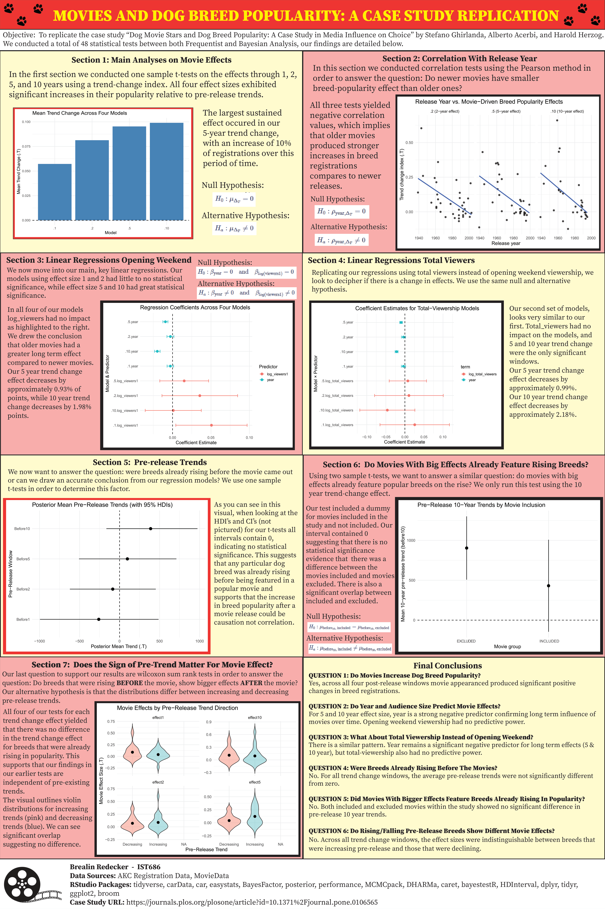

<h1>Project Description</h1> 

This project analyzed attendance at Major League Baseball games using data from over 23,000 games (2015–2025) to identify the key drivers of fan turnout and generate actionable insights for marketing and engagement strategies. 

I conducted exploratory data analysis on variables including day of the week, game time, weather conditions, team performance, star players, and ballpark characteristics. Using these insights, I built a series of regression models with a stepwise approach, incorporating transformations, interaction terms, and seasonality features such as game number and lagged attendance. 

The final model achieved strong predictive performance, explaining approximately 73% of the variance in attendance. Key drivers included home team performance, star player presence, weekend scheduling, and iconic ballparks, while poor weather conditions and less popular venues reduced turnout. Some expected effects—such as late-season divisional games—were weaker than anticipated, highlighting the complexity of fan behavior. 

Overall, this project demonstrates my ability to analyze large-scale real-world data, build and evaluate predictive models, and translate statistical results into meaningful business insights. 

<h2>Key Results</h2>
- Built a predictive model explaining ~73% of variance in MLB game attendance  
- Identified key drivers: team performance, star players, weekends, and ballpark characteristics  
- Quantified negative impacts of poor weather and low-demand venues  
- Revealed weaker-than-expected effects for late-season divisional games  

<h2>Tools Used:</h2> 
<b>Languages:</b> R  
<b>Libraries:</b> tidyverse, dplyr, lubridate, readr, ggplot2, gridExtra, psych, moments, summarytools, knitr, gt, broom, ggcorrplot, scales, patchwork 
<b>Techniques:</b> Multiple Linear Regression, Stepwise Model Selection, Feature Engineering, Interaction Effects, Time-Based Features  
<b>Data:</b> MLB game-level dataset (23,000+ observations, 2015–2025)  >

<h2>Key Visualisations:</h2>
Final Poster  
  